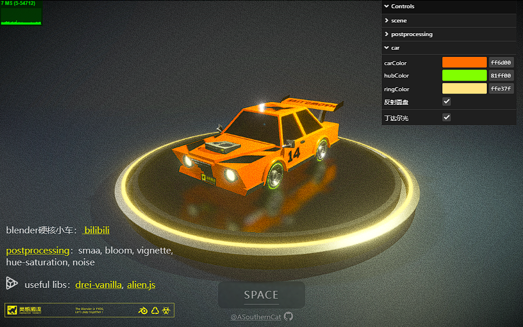

# simple-muscle-car
```
↗ ⭐⭐⭐  
```
- preview: <a href="https://simple-muscle-car-my3l.4everland.app/" target="_blank">link</a> 
- blender硬核小车：<a href="https://www.bilibili.com/video/BV1dC4y1C7wh/?share_source=copy_web&vd_source=26ace47c7332f85885e422f520eb62a7" target="_blank">bilibili</a>  


# ✅ run

```shell
npm install

npm run dev
```
## Customize configuration

See [Vite Configuration Reference](https://vitejs.dev/config/).

